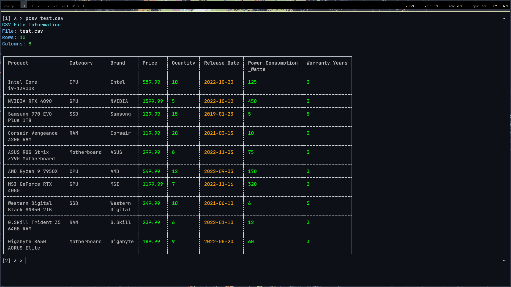

# pcsv – Pretty CSV Viewer



A fast, ncurses-free CLI utility that prints CSV/TSV files as colored, width-aware tables.
Configuration is done via a small TOML colorscheme file.

## Features

- UTF-8 borders using **comfy_table**.
- Automatic detection \& colouring of numbers, booleans, dates and empty cells.
- Alternating row background (“zebra”) for readability.
- Optional row numbers (`-r/--row-numbers`).
- Truncation of long fields (`-w/--width`, default 40).
- Display a subset of rows (`-n/--rows`, `0` = all).
- Pluggable colour schemes (`-c/--colors`, TOML file).


## Building / Installing

```bash
git clone https://github.com/yourname/pcsv
cd pcsv
cargo install --path .
# or just run in place
cargo run -- examples/data.csv
```


## Usage

```text
pcsv <FILE> [OPTIONS]

Options:
  -n, --rows <N>        Max rows to print (0 = all, default 50)
  -r, --row-numbers     Show row index
  -w, --width <N>       Max column width (default 40)
  -d, --delimiter <c>   Field delimiter (default “,”)
      --no-header       Treat first row as data, not header
  -c, --colors <FILE>   Colour-scheme TOML
  -h, --help            Show help
  -V, --version         Show version
```

Examples:

```bash
# basic
pcsv data.csv

# tab-separated
pcsv data.tsv -d '\t'

# full file, no truncation, Catppuccin palette
pcsv data.csv -n 0 -w 0 -c catppuccin.toml
```


## Colorschemes

Create a `.toml` file with the exact keys below; each value is an RGB triple:

```toml
dark0          = [30, 30, 46]   # background even rows
dark1          = [49, 50, 68]   # background odd  rows
dark2          = [69, 71, 90]   # unused (spare)
dark3          = [88, 91, 112]  # colour for “empty” cells

light0         = [205, 214, 244]  # header / generic text
light1         = [186, 194, 222]  # plain cell text
light2         = [166, 173, 200]  # spare

bright_green   = [166, 227, 161]  # numbers
bright_aqua    = [148, 226, 213]  # row index
bright_blue    = [137, 180, 250]  # (unused after v0.2)

neutral_blue   = [116, 199, 236]  # spare

bright_red     = [243, 139, 168]  # *reserved*
bright_orange  = [250, 179, 135]  # dates
bright_yellow  = [249, 226, 175]  # booleans

bright_purple  = [203, 166, 247]  # *reserved*
neutral_purple = [180, 190, 254]  # *reserved*
```


## Testing

```bash
cargo test
```

---


