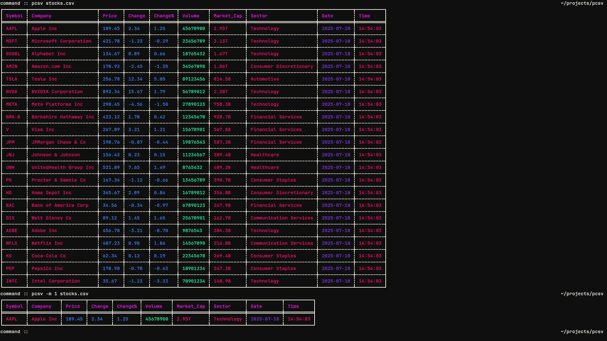

# Pcsv – Pretty CSV Viewer



A Rust-based command-line CSV viewer that automatically detects data types and applies intelligent color coding for enhanced data visualization. PCSV transforms plain CSV files into beautifully formatted, color-coded tables that make data patterns instantly recognizable.

## Features

- **Automatic Data Type Detection**: Intelligently identifies text, numbers, dates, booleans, and empty cells
- **Beautiful Color Coding**: Each data type gets its own distinct color for instant recognition
- **Interactive Pager Mode**: Navigate large files with a *less*-like paging interface
- **Customizable Configuration**: Create your own color schemes and scroll settings
- **High Performance**: Built in Rust for fast processing of large CSV files
- **Row Numbering**: Optional row numbers for easy reference
- **Flexible Input**: Read from files or stdin

## Installation

```bash
git clone https://github.com/deechtejoao/pcsv
cd pcsv
cargo install --path .
# or just run in place
cargo run -- examples/data.csv
```

## Usage

### Basic Usage

```bash
# View a CSV file
pcsv file.csv

# Read from stdin
echo "name,age,city" | pcsv -

# Show row numbers
pcsv -s file.csv

# Limit to first 50 rows
pcsv -m 50 large_file.csv

# Use custom configuration
pcsv -c /path/to/config.toml data.csv
```

### Interactive Pager Mode

For large CSV files, use the interactive pager mode (similar to `less` or `bat`):

```bash
# Enable pager mode
pcsv -p file.csv

# Combine with other options
pcsv -p -s large_file.csv
```

#### Pager Navigation Controls

| Key | Action |
|-----|--------|
| `j` / `↓` | Scroll down by configured lines (default: 1) |
| `J` | Scroll down by multiple lines (default: 10) |
| `k` / `↑` | Scroll up by configured lines (default: 1) |
| `K` | Scroll up by multiple lines (default: 10) |
| `Space` / `Page Down` | Scroll down by full screen |
| `b` / `Page Up` | Scroll up by full screen |
| `d` | Scroll down by half screen |
| `u` | Scroll up by half screen |
| `g` / `Home` | Go to beginning |
| `G` / `End` | Go to end |
| `q` / `Esc` | Quit pager |

 

## Configuration

### Color Schemes

Create custom color schemes by setting up a configuration file:

```bash
# Create configuration directory
mkdir -p ~/.config/pcsv/

# Create your config.toml file
touch ~/.config/pcsv/config.toml
```

Edit the file with your preferred colors:

```toml
# Data type colors (hex format)
data_types = { 
    text = "#EBDBB2", 
    date = "#FE8019", 
    float_number = "#B8BB26", 
    int_number = "#83A598", 
    boolean = "#FABD2F", 
    empty = "#504945" 
}

# Header color
header = "#83A598"

# Pager configuration
[pager]
scroll_single_line = 1     # Lines to scroll with 'j' and 'k'
scroll_multi_line = 10     # Lines to scroll with 'J' and 'K'
```

### Using Custom Configuration

```bash
# Use custom config file
pcsv -c ~/.config/pcsv/config.toml data.csv

# Use custom config with pager
pcsv -p -c ~/.config/pcsv/config.toml large_file.csv
```

## Command Line Options

| Option | Short | Description |
|--------|-------|-------------|
| `--show-row-numbers` | `-s` | Display row numbers |
| `--config` | `-c` | Use custom configuration file |
| `--max-rows` | `-m` | Limit number of rows displayed |
| `--pager` | `-p` | Enable interactive pager mode |

## Examples

### Viewing Different File Types

```bash
# Basic CSV viewing
pcsv sales_data.csv

# Large file with pager
pcsv -p huge_dataset.csv

# With row numbers
pcsv -s inventory.csv

# Limited rows
pcsv -m 100 recent_orders.csv

# From stdin
cat data.csv | pcsv -
```

### Custom Configuration Examples

**Dark Theme:**
```toml
data_types = { 
    text = "#E6E6E6", 
    date = "#FF6B6B", 
    float_number = "#4ECDC4", 
    int_number = "#45B7D1", 
    boolean = "#FFA07A", 
    empty = "#696969" 
}
header = "#FFD93D"
```

**High Contrast:**
```toml
data_types = { 
    text = "#FFFFFF", 
    date = "#FF0000", 
    float_number = "#00FF00", 
    int_number = "#0000FF", 
    boolean = "#FFFF00", 
    empty = "#808080" 
}
header = "#FF00FF"
```


## Data Type Detection

PCSV automatically detects and colors the following data types:

- **Text**: Regular text strings
- **Integers**: Whole numbers (e.g., `123`, `-456`)
- **Floats**: Decimal numbers (e.g., `3.14`, `-2.5`)
- **Booleans**: `true`, `false`, `yes`, `no`, `y`, `n`
- **Dates**: Various date formats (YYYY-MM-DD, MM/DD/YYYY, etc.)
- **Empty**: Empty or whitespace-only cells

## Performance

PCSV is optimized for performance:
- Built in Rust for speed and memory efficiency
- Lazy loading in pager mode for large files
- Efficient CSV parsing with the `csv` crate
- Minimal memory footprint

## Contributing

Contributions are welcome! Please feel free to submit issues, feature requests, or pull requests.

## License

This project is licensed under the MIT License.
